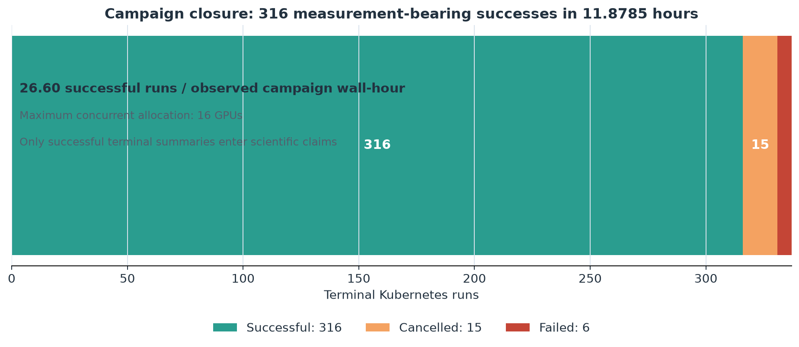
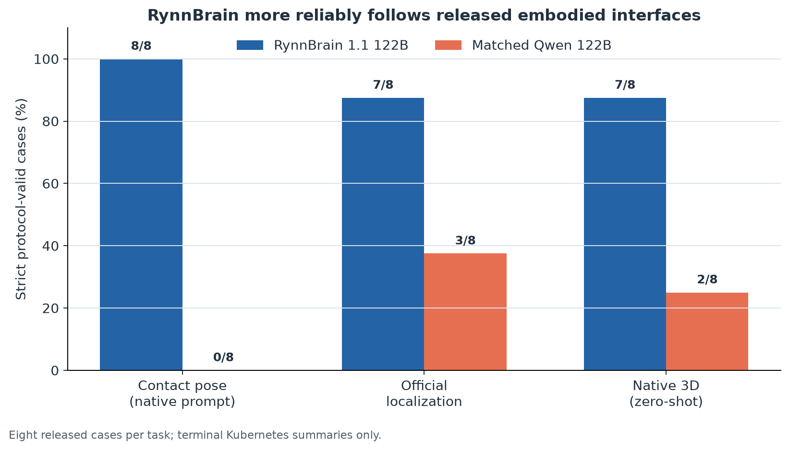
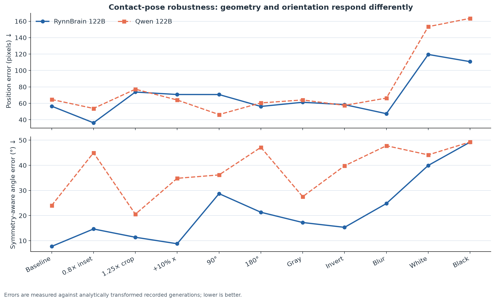
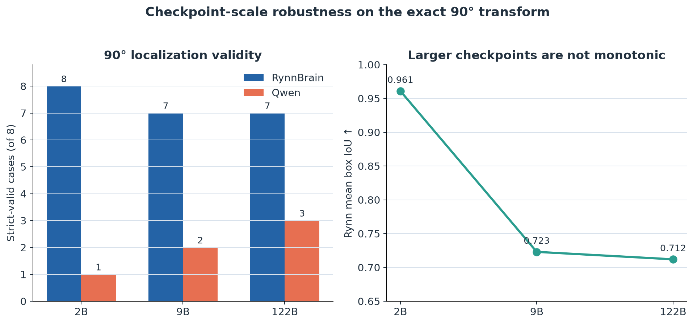
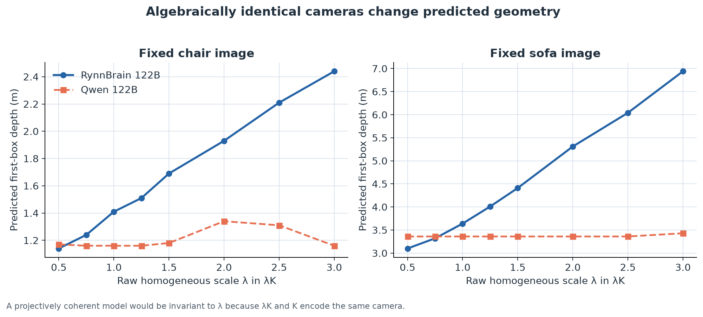

# RynnBrain 1.1 reproduction and diagnostic study

> **Verdict: partially reproduced.** Successful runs reproduce strong adherence to the released embodied task interfaces and partial visual-spatial/temporal conditioning. They do not establish benchmark accuracy, and exact projective controls expose a non-geometric camera-magnitude heuristic in native 3D.

Paper: [RynnBrain 1.1: Towards More Capable and Generalizable Embodied Foundation Model](https://arxiv.org/abs/2607.17977)

## Status and scope

This reproduction has successful terminal Kubernetes logs for contact-pose prediction, official localization cookbook tasks, and a diagnostic native-3D task across RynnBrain 1.1 and matched Qwen 3.5 checkpoints at 2B, 9B, and 122B-A10B scales. All reported generations are deterministic. The 122B models are balanced across eight GPUs; smaller-model scale controls in the latest localization round use the same evaluator and differ only in checkpoint ID.

The released examples do not provide task ground truth. Contact and localization perturbation errors therefore measure agreement with analytically transformed *recorded model generations*, not accuracy against human annotations. Native-3D metrics are internal consistency diagnostics, not AP3D benchmark scores.

*Figure 1. The publication audit found aggregate measurement summaries in all 316 successful terminal logs. Cancelled and failed jobs are retained as provenance but excluded from claims.*

## Main findings

1. **RynnBrain reliably speaks the embodied output languages.** On the native contact prompt, RynnBrain122B is 8/8 schema-valid while Qwen122B is 0/8. On the official localization cookbook, Rynn checkpoints are generally 7–8/8 valid; matched Qwen checkpoints are usually 1–3/8.
2. **Rynn's advantage is not merely formatting.** Under image flips, rotation, grayscale, affine resizing, and temporal reordering, Rynn often tracks the expected geometric or frame transformation. Qwen sometimes has competitive 2D position error after an explicit contact schema, but its angle predictions are more quantized and its localization serialization is brittle.
3. **Visual ablations separate grammar from grounding.** With white or black inputs, Rynn122B continues to emit valid task syntax but contact poses collapse near the center; black frames yield almost the same `(500,500,179.7)` response across prompts. Thus syntax validity alone is not evidence of visual grounding.
4. **Scale is not monotonic on the small diagnostic suite.** In the exact 90-degree localization scale sweep, Rynn2B is the only 8/8 model and has the best box IoU. Rynn9B and Rynn122B are both 7/8 with similar point error. This suite is only eight cases, so the result is diagnostic rather than a general ranking.
5. **Native 3D is strongest for Rynn9B in this harness.** Rynn9B gives 8/8 physically valid boxes with much lower center, dimension, and orientation error than Rynn2B. Qwen produces some semantically parseable 3D outputs but fewer physically valid boxes.
6. **Protocol obedience can hurt abstention.** When every requested 3D category is deliberately mismatched to the image, Rynn122B always emits a box and often produces extreme geometry; Qwen122B explicitly rejects five of eight mismatches.

*Figure 2. On the three released eight-case protocols, RynnBrain 122B is consistently more likely to return the requested machine-readable interface. Valid syntax is necessary but not sufficient evidence of grounding.*

## Contact-pose results at 122B

All position and angle errors below are relative to released recorded generations or their analytic transforms. Angle uses the 180-degree symmetry of a parallel-jaw gripper.

| Input / transform | Rynn valid | Rynn position px | Rynn angle deg | Qwen valid | Qwen position px | Qwen angle deg |
|---|---:|---:|---:|---:|---:|---:|
| Explicit-schema color baseline | 8/8 | 56.52 | 7.74 | 8/8 | 64.68 | 24.04 |
| Centered 0.8x inset | 8/8 | 36.28 | 14.68 | 8/8 | 53.78 | 45.01 |
| Centered 1.25x crop | 8/8 | 73.75 | 11.38 | 8/8 | 77.21 | 20.56 |
| Shift right by 10% width | 8/8 | 70.74 | 8.80 | 8/8 | 64.06 | 34.84 |
| 90-degree clockwise | 8/8 | 70.70 | 28.74 | 8/8 | 46.31 | 36.19 |
| 180-degree rotation | 8/8 | 56.21 | 21.33 | 8/8 | 60.52 | 47.16 |
| Grayscale | 8/8 | 61.29 | 17.25 | 8/8 | 64.11 | 27.54 |
| RGB inversion | 8/8 | 58.40 | 15.33 | 7/8 | 57.48 | 39.81 |
| Gaussian blur, radius 16 | 8/8 | 47.38 | 24.81 | 8/8 | 66.39 | 47.81 |
| White frame | 8/8 | 119.53 | 39.96 | 8/8 | 153.39 | 44.16 |
| Black frame | 8/8 | 110.77 | 49.24 | 7/8 | 163.52 | 49.30 |

*Figure 3. Rynn is usually more stable in orientation, while position behavior is mixed. Both checkpoints degrade sharply when pixels are removed, separating interface compliance from visual evidence.*

The inset result is especially useful: both models preserve syntax, but Rynn is better by 17.50 px and 30.34 degrees. The complementary crop worsens position for both models despite keeping every transformed reference in-bounds, suggesting loss of peripheral context rather than a coordinate-range artifact. Under the 10%-width translation, Rynn's predicted x displacement has mean/median 92.1/93.0 against the expected 100.1, while Qwen's is 116.6/111.5. Qwen has slightly lower position error, but Rynn preserves the grasp angle much better (8.8 vs 34.8 degrees). Strong blur leaves Rynn's position intact but degrades orientation, consistent with low-frequency shape supporting centers while fine image cues support grasp angle. RGB inversion barely affects Rynn, while Qwen fails the color-dependent red-cup case and has much worse angle error over its seven parsed poses. The 90-degree result is more nuanced: Qwen is better on mean position, while Rynn is better on angle and uses more case-specific orientations. At 180 degrees, Rynn is better on both metrics.

The black-frame Rynn outputs reveal an unconditional fallback: six cases are exactly `(500,500,179.7)`, while the remaining two differ only slightly. Qwen's ablated outputs vary more with the text, but this variation does not improve agreement with the visual references.

## Official localization cookbook

The eight cases cover object boxes, area points, affordance points, and trajectories over images and short videos. Frame match is measured only on the four video cases.

### Baseline and major perturbations

| Model / input | Strict valid | Frame matches | Mean box IoU | Mean point Chamfer px |
|---|---:|---:|---:|---:|
| Rynn2B baseline | 8/8 | 4/4 | 0.998 | 5.39 |
| Rynn9B baseline | 7/8 | 4/4 | 0.980 | — |
| Rynn122B baseline | 7/8 | 3/4 | 0.984 | — |
| Qwen2B baseline | 3/8 | 0/4 | — | — |
| Qwen9B baseline | 2/8 | 0/4 | — | — |
| Qwen122B baseline | 3/8 | 0/4 | — | — |
| Rynn122B grayscale | 7/8 | 3/4 | 0.518 | — |
| Rynn122B 180-degree | 8/8 | 3/4 | 0.704 | ~279 |
| Rynn122B vertical flip | 8/8 | 3/4 | 0.714 | 137.70 |
| Rynn122B white frame | 6/8 | 1/4 | 0.297 | — |
| Rynn122B reversed video order | 8/8 | 2/4 | 0.982 | 194.95 |
| Rynn122B cyclic +2 frames | 8/8 | 1/4 | 0.831 | 186.22 |
| Rynn122B centered 0.8x inset | 7/8 | 2/4 | 0.978 | 160.95 |

The reversed and cyclic frame tests show partial temporal conditioning. Under reversal, the blue-cloth and pillow cases choose the exact analytically remapped frame; under a cyclic +2 shift, the chopsticks case chooses the exact shifted frame with only 2.24 px trajectory error. Other cases drift, so the model is not simply copying an absolute frame index, but temporal equivariance is incomplete.

### Exact 90-degree scale sweep

| Checkpoint | Strict valid | Frame matches | Mean box IoU | Mean point Chamfer px |
|---|---:|---:|---:|---:|
| RynnBrain2B | 8/8 | 2/4 | 0.961 | 207.50 |
| RynnBrain9B | 7/8 | 2/4 | 0.723 | 201.92 |
| RynnBrain122B-A10B | 7/8 | 2/4 | 0.712 | 200.37 |
| Qwen2B | 1/8 | 0/4 | — | 318.57 |
| Qwen9B | 2/8 | 2/4 | — | 638.59 |
| Qwen122B-A10B | 3/8 | 0/4 | — | 208.75 |

*Figure 4. Scale is not monotonic on this eight-case diagnostic: Rynn2B is the only fully valid checkpoint and has the highest transformed box IoU, while all Rynn sizes remain substantially more protocol-valid than matched Qwen.*

Rynn2B's microwave and blue-cloth box IoUs are 0.940 and 0.981. Larger Rynn checkpoints have similar point geometry but worse box agreement and one trajectory point-count failure. Qwen frequently switches to incompatible box/XML/list or verbose per-frame formats, which is itself an important mismatch with the released cookbook protocol.

## Native 3D diagnostic

| Model | Strict semantic | Physical boxes | Projection valid | Center err m | Dimension err m | Angle err normalized |
|---|---:|---:|---:|---:|---:|---:|
| RynnBrain2B | 8/8 | 8/8 | 8/8 | 0.174 | 0.350 | 0.390 |
| RynnBrain9B | 8/8 | 8/8 | 8/8 | 0.101 | 0.090 | 0.0067 |
| Qwen2B | 7/8 | 3/8 | 7/8 | 0.179 | 0.230 | 0.168 |
| Qwen9B | 7/8 | 5/8 | 5/8 | 0.226 | 0.358 | 0.0767 |

Doubling the focal length increases predicted depth by roughly 1.4–1.9x, whereas shifting the principal point is mostly ignored. Removing intrinsics changes geometry, and white-frame inputs collapse grounding. Horizontal and vertical flips induce the expected sign changes in several coordinates. A one-shot tagged example rescues Qwen's serialization but does not make its boxes consistently physical or geometrically accurate.

The rescue is not simple numeric copying. Replacing Qwen's original near-chair formatting example with a deliberately distant synthetic box preserves the 7/8 tagged/projectable rate and moves first-box centers by only 0.380 m on average; one table prediction is exactly unchanged, and outputs remain 4.013 m from the new anchor on average. Reference center/dimension/angle errors are 0.234/0.374/0.116, comparable to and slightly better than the original example's 0.245/0.434/0.162, although physical validity falls from 2/8 to 1/8. The example values measurably perturb a few cases, but its main causal role is schema selection rather than supplying the predicted geometry.

A nonnumeric template isolates that role further. Replacing the demonstrated numbers with literal field-name placeholders still gives Qwen 7/8 tagged/projectable and 2/8 physically valid outputs; the same driving-car response is malformed. Center/dimension/angle errors are 0.237/0.333/0.166, essentially matching the numeric example's 0.245/0.434/0.162. Positive coordinate values are therefore unnecessary for the serialization rescue: an explicit tagged output skeleton is sufficient.

That equivalence is model-specific. Rynn's tag-only template gives 8/8 tagged/projectable but only 3/8 physically valid outputs, with center/dimension/angle errors of 0.179/0.573/0.236. Relative to zero-shot Rynn (7/8 tags, 3/8 physical, 0.164/0.836/0.151), the skeleton repairs syntax and dimensions but worsens rotations; relative to numeric one-shot Rynn (8/8 tags, 5/8 physical, 0.217/0.509/0.107), it loses structural and rotational quality. Rynn therefore benefits from positive numeric scaffolding beyond the schema-selection effect that explains Qwen's rescue.

Instruction recency also repairs Qwen's physical compliance. Repeating the box constraints after the numeric example raises tag/projection validity from 7/8 to 8/8 and physical validity from 2/8 to 4/8; the formerly malformed driving-car response becomes two valid tagged boxes. Center/dimension/angle errors improve from 0.245/0.434/0.162 to 0.219/0.291/0.161. As with the no-object-last safety result, the last instruction exerts disproportionate control, here improving both schema and dimensions without an aggregate accuracy cost.

Moving rather than duplicating those constraints establishes causality. With the original early constraint block removed and the same rule placed only after the numeric example, Qwen still reaches 8/8 tags/projections and 4/8 physical validity; center/dimension/angle errors are 0.239/0.334/0.164. Last position, not repetition count, causes the compliance repair. Duplication contributes only the smaller additional center/dimension gain to 0.219/0.291.

That repair requires the numeric example. Adding the same final reminder after Qwen's tag-only template leaves tag/projection at 7/8 and physical validity at 2/8, with the driving-car response still malformed; center/dimension/angle errors change from 0.237/0.333/0.166 to 0.269/0.383/0.173. Constraint recency therefore interacts with positive numeric scaffolding instead of acting as a standalone compliance instruction.

Enabling explicit step-by-step reasoning changes that tag-only-plus-reminder result substantially. Qwen remains 7/8 tagged/projectable, but physical validity rises from 2/8 to 5/8 and center error falls from 0.269 to 0.138 m; dimension error improves slightly from 0.383 to 0.361 m, while angle error worsens from 0.173 to 0.201. The gain is costly: mean inference rises to 56.6 seconds, the office-chair case spends 120.6 seconds without producing a parsed box, and the driving image receives two boxes with invalid dimensions. Reasoning improves metric-scale estimation and constraint attention on most cases but reduces latency and does not eliminate completion failures.

Rynn reacts in the opposite direction. Relative to its matched tag-only-plus-reminder control (8/8 tagged/projectable, 5/8 physical, 0.134/0.570/0.210 center/dimension/angle errors), thinking mode falls to 5/8 tagged/projectable and 3/8 physical, with errors 0.222/0.395/0.260. Dimension estimation improves, but center and angle worsen; driving, office-chair, and bottle cases produce no parsed box, and mean inference rises to 35.0 seconds. Explicit reasoning is therefore not a checkpoint-independent upgrade: it trades latency and completion reliability for mixed geometric effects, helping Qwen's center/constraints but broadly harming Rynn's released task interface.

Yet the final reminder has a broader zero-shot alignment effect. With no example or tag-only template, it raises Qwen from 2/8 tagged/projectable and 1/8 physical outputs to 7/8 tagged/projectable and 3/8 physical, with parsed center/dimension/angle errors of 0.238/0.380/0.173; the driving-car case remains malformed. A last-position “final answer check” can therefore substitute for the tag skeleton as a task/schema cue, while the numeric example is needed only for the further 8/8-tag, 4/8-physical repair.

The same repetition does not repair Rynn. It preserves 8/8 tagged/projectable outputs but lowers physical validity from 5/8 to 4/8; center error improves from 0.217 to 0.175 m while dimension/angle errors remain similar (0.509/0.107 to 0.535/0.109). Constraint recency is therefore a Qwen-specific compliance lever in this test, whereas Rynn's already stronger structural behavior is perturbed rather than improved.

Moving rather than duplicating the constraints confirms that interpretation. Rynn remains essentially at its original 8/8 tags/projections, 5/8 physical validity, and 0.213/0.507/0.100 center/dimension/angle errors versus 0.217/0.509/0.107 originally. Rynn shows no numeric-scaffold recency effect; the duplicated prompt's lower 4/8 physical rate and better center error arise from redundancy-induced perturbation, not last position.

Rynn does benefit from the final reminder zero-shot. Without any example or template, it improves from 7/8 tags/projections and 3/8 physical outputs to 8/8 and 4/8; center/dimension/angle errors change from 0.164/0.836/0.151 to 0.202/0.534/0.170. The reminder also beats tag-only Rynn on physical validity, dimensions, and angle, albeit not center error. Last-position answer checking is therefore an effective zero-shot alignment cue for both models, even though its interactions with added scaffolding diverge.

But Rynn's response reverses when the numeric example is removed. Repeating final constraints after its tag-only template raises physical validity from 3/8 to 5/8 while retaining 8/8 tags/projections; center/dimension/angle errors improve from 0.179/0.573/0.236 to 0.134/0.570/0.210. Qwen benefits only when the reminder follows numeric scaffolding, while Rynn benefits only when it follows tag-only scaffolding. These prompt components are strongly non-additive, so isolated instruction ablations do not reliably predict combined behavior.

Rynn is likewise not copying the numeric example, though its outputs are somewhat more value-sensitive. The distant anchor preserves 8/8 tagged/projectable and 5/8 physically valid outputs, with only 0.349 m mean center drift from the original-anchor run and 4.378 m mean distance from the new anchor. Center error improves slightly from 0.217 to 0.190 m and dimension error changes from 0.509 to 0.575 m, but angle error worsens from 0.107 to 0.234. The formatting benefit is stable across anchor choices, while demonstrated numbers can still perturb rotations and a few geometries.

At 122B, horizontal image flipping gives especially direct evidence of 3D center equivariance. Across seven cases with unflipped calibration outputs, Rynn's mean error to the analytically sign-flipped center is 0.140 m (x error 0.069 m), versus 0.822 m (x error 0.774 m) if compared with the unflipped center. All eight outputs remain tagged and projection-valid, although only 3/8 satisfy the evaluator's physical-dimension constraint. A format-rescued Qwen122B control also tracks the sign flip (0.224 m expected-center error and 0.070 m x error, versus 0.660 m and 0.593 m against unflipped centers), but is weaker in schema/projection validity at 7/8. Its mean distance from the one-shot anchor is 1.009 m, ruling out simple anchor copying.

Vertical equivariance is weaker and mixed. Rynn122B's expected y-flip error is 0.183 m versus 0.389 m for unchanged y, with full-center errors 0.335 versus 0.514 m. Format-rescued Qwen122B has lower expected y error (0.080 versus 0.171 m unchanged), but only a small full-center preference (0.315 versus 0.345 m) because x/depth drift dominates. Both therefore respond to vertical position, but neither matches the clean horizontal sign-flip behavior.

Doubling both focal lengths provides a matched 122B calibration test. Rynn122B's predicted depth ratio relative to its native-intrinsics output is mean 1.598 and median 1.564 across seven comparable cases: a clear but under-scaled response to the analytically expected 2x depth. Its mean center error is 1.393 m under the doubled-focal expectation versus 1.431 m if left unscaled. Qwen122B instead has mean/median depth ratios 1.071/1.051, and is closer to its unscaled baseline (0.246 m) than to the expected recalibration (0.290 m). Thus the Rynn checkpoint is substantially more sensitive to focal calibration, although neither model obeys the pinhole transformation cleanly and Rynn's x/y changes are inconsistent.

Shifting the principal point by +200 pixels exposes a sharper limitation. Rynn122B's mean x error is 0.815 m under the analytically shifted expectation but only 0.009 m relative to its unchanged center; Qwen122B's corresponding errors are 0.634 m and 0.106 m. Both models therefore mostly ignore principal-point calibration. Rynn retains stronger structural validity (8/8 tagged, 7/8 projection-valid, 5/8 physically valid) than the format-rescued Qwen control (7/8, 6/8, and 2/8), but that protocol advantage does not imply correct calibration use.

Removing the intrinsics paragraph reveals that its role is partly categorical rather than numeric. Rynn122B reverts to the official 2D `<object>` corner-box protocol in four cases, leaving only 4/8 tagged 3D outputs and 1/8 physically valid boxes. Yet the four remaining 3D centers move by just 0.244 m on average, with only 0.023/0.030 m mean x/y changes. The one-shot Qwen control keeps 7/8 tagged outputs because it retains an explicit serialization example, but its centers also move only modestly (0.187 m; 0.096/0.054 m x/y). Together with the principal-point result, this suggests that the textual intrinsics block is a strong task-selection cue while its numerical values are used inconsistently.

Blank-image native-3D tests further separate visual grounding from learned priors. Unassisted Rynn122B retains tagged, physical 3D boxes in only 2/8 cases; the other six responses switch to 2D syntax or degenerate image/file placeholders. The format-rescued Qwen control emits tags in 8/8 cases and physically valid boxes in 6/8, including class-plausible scales such as 11.6 m car depth and 0.69 m bottle depth, despite receiving no visual evidence. Its mean distance from the serialization anchor is 1.947 m, so it is not copying the example values. These are text-conditioned 3D priors rather than grounded predictions; syntax rates are not directly comparable because Qwen receives the extra one-shot format cue.

Matched scaffolding reveals an even stronger interaction. Zero-shot Qwen explicitly abstains on 7/8 white frames, while its one-shot version hallucinates boxes in 8/8. Rynn moves in the opposite direction: adding the same format-only example makes all eight white-frame generations terminate with an empty response, compared with two hallucinated 3D boxes and six malformed/2D outputs zero-shot. Thus a seemingly harmless serialization example can dominate semantic abstention, and its effect is model-specific.

An explicit negative instruction partly repairs Qwen's one-shot failure: “return exactly `<no object>` and do not invent a box” restores exact abstention in 5/8 blank cases, versus 0/8 without the instruction. The remaining failures are strongly class-prior driven—two chair boxes, one sofa box, and five bottle boxes are hallucinated on pure white input. No response mixes a box with the no-object token. This is a meaningful safety gain, but not a complete repair.

On the matched real-image control, Qwen never abstains in eight genuine-object cases while retaining 7/8 tagged/projection-valid outputs; the eighth car response contains two boxes inside one malformed tag rather than a semantic rejection. Rynn likewise never abstains and stays tagged/projection-valid in 8/8, with center/dimension/angle errors of 0.172/0.469/0.100—slightly better than its category-specific one-shot parent. The repair therefore improves white-frame specificity without an observed semantic false-negative or accuracy cost on this small suite, although Qwen's physical validity remains only 2/8.

For Rynn, the same instruction produces exact `<no object>` in 8/8 white-frame cases with no mixed or hallucinated boxes. Because the matched one-shot parent already returned an empty response in all eight cases, the repair changes implicit abstention into a deterministic, machine-readable decision rather than altering the semantic outcome. Real-image controls are required before treating this as a safe deployment prompt.

False-category prompts show a complementary safety failure. Rynn122B emits a tagged box for all eight deliberately mismatched requests, but only 2/8 are physically valid; failures include a sofa at 100 m depth in a driving image and rotations outside the stated normalized range. Qwen122B explicitly answers that the requested category is absent in 5/8 cases and hallucinates a box in 3/8. The evaluator's nominal format rate counts those semantically appropriate empty-set responses as invalid, so raw response inspection is essential. Rynn's stronger learned interface compliance does not confer better abstention under an invalid premise.

Qwen's 5/8 rejection and 3/8 hallucination split is unchanged by the positive serialization example. Zero-shot hallucinations appear as JSON and the five rejections as prose; one-shot converts the same three accepted cases into tagged boxes while leaving the five semantic rejections intact. The example controls output syntax here, whereas explicit negative language and its placement control the accept/reject decision.

A prompt-factorial control makes the one-shot interaction causal for Qwen. With the explicit no-object instruction but no serialization example, Qwen returns exact `<no object>` for all eight mismatched categories. Adding the positive box example changes the otherwise matched behavior to only 1/8 abstentions and 7/8 boxes, including mixed box-plus-no-object output. Positive format demonstrations can therefore override explicit negative safety instructions.

Prompt order fully repairs that conflict for both models. Keeping the positive example but repeating “return exactly `<no object>`” after it restores exact abstention in 8/8 mismatched cases for Qwen and Rynn. The same ingredients therefore move Qwen from 1/8 to 8/8 and Rynn from 0/8 to 8/8 abstention solely by placing the negative instruction after the demonstration, a strong cross-model recency effect.

Qwen's matched real-image control shows no false-negative cost: the no-object-last prompt produces boxes in all eight genuine-object cases, with 8/8 tagged/projection-valid and 3/8 physically valid outputs. Its center/dimension/angle errors (0.266/0.347/0.132) modestly improve over placing the same instruction before the example (0.305/0.431/0.164). On this small suite, last-position safety language gives perfect true/false semantic separation without degrading 3D accuracy.

Rynn also produces boxes in all eight matched real-image cases, giving the same perfect mismatch/matched semantic split, but its geometry exposes a tradeoff. Moving the instruction last changes center/dimension/angle errors from 0.172/0.469/0.100 to 0.219/0.855/0.097 and lowers physical validity from 5/8 to 3/8, driven especially by bed dimensions. The repair avoids semantic false negatives but is not quality-neutral for Rynn.

Rynn shows the same direction but a much lower abstention ceiling. Its zero-shot explicit-no-object mismatch run abstains in only 1/8 cases, and adding the positive example removes that sole abstention: all eight false-category prompts receive a box, including a 100 m-deep sofa in a driving scene and normalized rotations as large as 2.58. The positive example weakens abstention in both models, but Qwen without it is substantially safer on this test.

For one-shot Rynn, placing the negative instruction before the example has virtually no effect: mismatch runs with and without it both emit one box in 8/8, with nearly identical center errors (1.436 vs 1.448 m). Its complete reversal when the instruction moves last shows that prompt order, rather than instruction content alone, governs this safety behavior.

An unknown-label control shows that the one-shot Qwen prompt weakly gates boxes by category semantics. Replacing every target name with the nonce word “blicket” still yields a scene-object box in all eight cases (7/8 parseable), with 0.264 m mean error to the shown image's canonical object reference and 0.237 m dimension error. One driving output degenerates into 61 seconds of repeated numeric tokens, but the other predictions remain near chair, bed, table, sofa, or bottle baselines. Under positive format scaffolding, an unknown label is treated like generic foreground grounding rather than a reason to abstain.

Defining that nonce explicitly—`“blicket” means the visual category “chair”`—removes most of Qwen's semantic uncertainty. The matched tag-only run becomes 8/8 tagged/projectable and 5/8 physically valid, with center/dimension/angle errors of 0.189/0.181/0.129 and no repeated-token failure, versus 7/8 parseable, 2/8 physical, and 0.264/0.237 center/dimension errors for the undefined one-shot nonce. The definition does not merely repair syntax: it gives the model a usable class referent and improves geometric plausibility across the mixed-category images.

Rynn's paired defined-nonce run shows an even larger geometric repair: it remains 8/8 tagged/projectable and 3/8 physical, while center/dimension error falls from the undefined one-shot nonce's 1.381/1.302 m to 0.190/0.533 m. The outputs revert close to ordinary tag-only foreground predictions—a 3.30 m bed, 16.0 m driving object, 3.71 m sofa, 2.21 m lounge table, and 1.09 m bottle—even though every query says `“blicket” means ... “chair”`. Thus lexical definition suppresses Rynn's unstable nonce prior, but neither checkpoint treats the defined class as a strict absence constraint; both default to grounding visible foreground across mismatched scenes.

That semantic acceptance does not require the one-shot example. Zero-shot Qwen emits a JSON 3D box for “blicket” in all eight scenes, compared with rejecting 5/8 known-but-absent category names. The model treats an unknown word as a placeholder label to attach to visible foreground, whereas a known incompatible class can trigger absence recognition. The example primarily converts JSON to tagged syntax, although it also shifts some numeric predictions.

Rynn also accepts “blicket” zero-shot in all eight scenes, emitting exactly one correctly tagged and projectable box each time (3/8 physically valid). Its mean reference errors are 1.119 m for center, 1.269 m for dimensions, and 0.567 in normalized angle; the lounge sofa and lounge table prompts even receive identical geometry. Both models therefore treat a nonce label as generic foreground rather than absence, but Rynn follows the requested tagged schema without needing a positive formatting example, whereas zero-shot Qwen returns untagged JSON.

Adding the numeric formatting example to Rynn's nonce prompt preserves 8/8 tagged/projectable output and raises physical validity only from 3/8 to 4/8. Center/dimension errors slightly worsen from 1.119/1.269 m to 1.381/1.302 m, while angle error improves sharply from 0.567 to 0.146. The bed prediction `(0.91,-0.91,6.04)` exactly matches the fixed-bed sweep's blicket geometry, and the lounge sofa/table still share a box. For Rynn, “blicket” therefore invokes a stable label-conditioned prior more than generic foreground grounding; numeric scaffolding regularizes orientation without improving localization.

A fixed-image sweep makes the text/image interaction more explicit for Qwen. Holding one chair image and its intrinsics constant while requesting chair, bed, table, car, sofa, bottle, “blicket,” or generic object yields boxes in 7/8 cases and abstention only for car. Chair, bed, blicket, and object centers are nearly identical; sofa also stays close to the visible chair, while table and bottle shift geometry more strongly. Visual evidence dominates the object hypothesis, but label text modulates geometry and can selectively gate output.

A second fixed-image sweep shows that Qwen's semantic gating depends strongly on the visual scene. Holding a bed image fixed, Qwen accepts only bed, table, “blicket,” and generic object, while rejecting chair, car, sofa, and bottle; the chair image accepted seven of the same eight labels. Bed, blicket, and the first generic-object box have nearly identical bed-like centers around `(-0.12,-0.2,2.72)`, whereas table shifts to `(0.83,-0.09,4.56)` and generic object enumerates five boxes. Thus the nonce label remains attachable to visible foreground, while known-class rejection reflects an image-conditioned text gate rather than a fixed label blacklist.

Rynn is much more label-driven on the identical chair sweep. It emits a box for all eight labels, but mean error to the shown-chair reference is 0.717 m versus Qwen's 0.276 m. Only the chair request remains near the visible chair; bed/table shift together to roughly `(0.71,0.33,1.31)`, sofa to `(0.81,0.44,1.39)`, car and bottle become tiny boxes, and blicket/generic object share another geometry. Rynn's learned category priors can override the visible object while preserving perfect tag syntax.

The fixed-bed sweep strengthens that conclusion. Rynn again emits one tagged and projectable box for all eight requested labels (4/8 physically valid) and never abstains. Only the matched bed prompt grounds the visible bed well, with 0.302 m center error and prediction `(0.01,-0.02,3.31)`; chair, table, car, sofa, bottle, blicket, and generic object move to label-dependent centers 2.5–5.0 m from the bed, producing 2.992 m aggregate center error. The nonce “blicket” is particularly far at `(0.91,-0.91,6.04)`. Qwen instead rejects four known-incompatible fixed-bed labels and keeps nonce/generic predictions near the bed, exposing a sharp model difference: Rynn always satisfies the requested schema but lets text priors overwhelm visual geometry, while Qwen performs image-conditioned category gating.

Strong Gaussian blur preserves 3D syntax but destabilizes Rynn's geometry: both models remain 8/8 tagged and projection-valid, while Rynn has 2/8 physically valid boxes versus Qwen's 4/8. Rynn's mean center change is 0.609 m and its recorded dimension/orientation errors rise to 0.702/0.752, including normalized rotations as large as 2.29; Qwen's corresponding center change is 0.461 m and dimension error 0.160. This reverses the contact-pose blur pattern, where Rynn retained the better center and angle metrics, and shows that robustness is task-interface specific.

Changing only the textual camera convention is mostly ignored. For “x points left,” Rynn122B is much closer to unchanged centers than to analytically x-negated centers (0.082 vs 0.802 m); Qwen122B shows the same pattern (0.132 vs 0.517 m). For “y points up,” the unchanged-versus-negated errors are 0.080 vs 0.381 m for Rynn and 0.062 vs 0.210 m for Qwen. This sharply contrasts with actual horizontal and vertical image flips, which induce the expected sign changes. Visual equivariance therefore does not imply instruction-level control over the coordinate frame.

The learned numeric convention is also resistant to explicit unit changes. When asked for centimeters, Rynn122B remains only 0.063 from its unchanged meter-valued centers but 287.4 numeric units from the expected 100x values; Qwen is 0.352 from unchanged values and 206.9 from the centimeter target. Both keep emitting tagged boxes, demonstrating that serialization compliance can coexist with complete unit noncompliance.

Alternative center representations are similarly brittle. Asked for pixel `(u,v,z)`, Rynn122B keeps Cartesian meter-scale x/y in every parsed case; Qwen does so in six of seven, but correctly switches the manipulation bottle to `(552,366,0.97)`. With `[0,1000]` normalized UVZ, Qwen again switches only the bottle `(544,356,0.90)` while seven cases retain Cartesian-scale values. The learned output representation is therefore substantially more rigid than the tag syntax, with only narrow evidence of Qwen representation switching.

Grayscale is substantially less disruptive than blur or blank frames. Rynn122B remains 8/8 tagged/projection-valid and 4/8 physically valid, with 0.335 m mean center drift dominated by a 1.73 m office-chair outlier. Qwen remains 7/8 tagged/projection-valid and only 1/8 physically valid, but its center drift is lower at 0.151 m. Rynn better preserves protocol and structural validity; Qwen's centers are more color-invariant on this suite.

Calibrated image transforms expose partial calibration use. With images and intrinsics both scaled to half resolution, center drift is 0.694 m for Rynn and 0.267 m for Qwen. Under a 1.25x center crop, corrected intrinsics nearly halve Rynn's center drift versus leaving intrinsics unchanged (0.337 vs 0.625 m) and raise projection validity from 6/8 to 8/8. Qwen shows no center benefit (0.385 m calibrated vs 0.338 m uncalibrated), though projection validity also rises from 6/8 to 8/8. Rynn therefore uses calibration partially in the coupled crop setting despite ignoring isolated principal-point, axis, and unit changes.

A dense fixed-chair resolution control shows that this use is not scale-invariant. Resizing the same pixels and scaling `f_x/f_y/c_x/c_y` together by 0.5×, 0.625×, 0.75×, 0.875×, 1×, 1.125×, 1.25×, and 1.5× yields Rynn depths 1.12, 1.20, 1.34, 1.40, 1.41, 1.47, 1.50, and 1.71 m. These calibrated representations preserve normalized rays apart from resampling, yet depth rises strictly with absolute resolution and angles become unstable, leaving 0/8 physical despite 8/8 tags/projections. Some drift can arise from interpolation and changed visual detail, but its ordered direction together with the homogeneous-gauge result shows substantial raw pixel/intrinsics-scale dependence.

Qwen's matched calibrated-resolution depths are 1.34, 1.26, 1.07, 1.31, 1.16, 1.34, 1.31, and 1.31 m: strongly non-monotonic, with 8/8 tags/projections and 4/8 physical boxes. It is also not resolution-invariant, but switches among familiar templates rather than converting absolute scale into Rynn's ordered depth association. A no-intrinsics resolution control is needed to separate image-resampling effects from the paired numeric-camera cue.

That ablation removes Rynn's ordered trend. With the same eight resized chair images but no intrinsics block, depths are 1.24, 1.40, 1.30, 1.34, 1.30, 1.30, 1.31, and 1.30 m: non-monotonic and nearly flat above 0.75×. All outputs still parse/project, so the calibrated sweep's strict 1.12→1.71 m rise is driven mainly by scaled camera numbers rather than visual resampling alone. Omitting the block also changes the task cue and native template (1.41→1.30 m), but the within-sweep contrast isolates the ordinal component to numeric intrinsics.

Qwen remains non-monotonic without intrinsics: depths are 1.34, 1.34, 1.29, 1.31, 1.08, 1.16, 1.16, and 1.19 m, with 8/8 tags/projections and 3/8 physical boxes. Resized pixels alone therefore trigger substantial Qwen template changes; adding calibrated intrinsics changes which templates appear but does not create an ordered response. This causal contrast is checkpoint-specific: numeric intrinsics introduce Rynn's strict scale trend, whereas Qwen remains template-driven with or without them.

Cyclic-image controls confirm that the 3D output is visually conditioned rather than merely retrieved from the requested category. When each prompt is paired with another case's image, Qwen's mean center error is 0.244 m relative to the shown image's reference but 0.861 m relative to the original prompt case; it also declines two absent-category requests. Rynn's corresponding errors are 2.889 m versus 16.077 m, with 7/8 tagged outputs. Both follow the substituted image, but Rynn's geometry is markedly less stable in this adversarial pairing.

Same-category swaps remove the category-text confound. Exchanging only the two chair images or two table images leaves the noun unchanged, yet Qwen's four swapped centers exactly reproduce its tag-only baseline outputs for the shown image: office chair `(0.29,0.02,2.75)`, SUN chair `(-0.13,-0.03,1.16)`, lounge table `(0.17,0.05,2.04)`, and SUN table `(0.23,-0.21,2.23)`. Mean shown-image center error stays 0.237 m while error to the original case rises to 0.567 m, with unchanged 7/8 schema/projection and 2/8 physical validity. Qwen's center prediction is therefore directly image-conditioned even within a fixed category.

An image-only decomposition keeps each original prompt's intrinsics while swapping those pixels. Qwen still follows the shown instance: SUN chair and lounge table exactly match their shown-image baselines, while office-chair depth changes only from 2.75 to 2.52 m and the SUN-table center from `(0.23,-0.21,2.23)` to `(0.25,-0.15,2.00)` relative to swapping both image and intrinsics. Mean shown-reference error is 0.180 m. Pixels determine the instance; incompatible camera numbers cause only modest depth/center shifts.

The intrinsics-only complement reproduces those exact two shifts while leaving pixels fixed: office-chair depth becomes 2.52 m under SUN intrinsics and the SUN-table center becomes `(0.25,-0.15,2.00)` under lounge intrinsics, while SUN chair and lounge table ignore their swapped numbers. Qwen's decomposition is internally consistent: visual pixels select the instance and base geometry, while intrinsics provide sparse, case-specific corrections rather than a general calibration transform.

A fixed-SUN-chair sweep makes that sparsity stark. Cycling all eight suites' intrinsics—from SUN to office, driving, and bottle cameras—produces the identical Qwen box `(-0.13,-0.03,1.16,0.52,0.84,0.61,0.25,0.16,0.12)` every time. Projection falls only for the office camera because the unchanged center no longer projects inside. Qwen can use camera numbers weakly on particular images, but it has no general fixed-image calibration response.

A controlled focal-only sweep exposes small threshold effects hidden by that mixed-camera set, but still no geometric scaling law. Holding the chair pixels and principal point fixed, Qwen keeps depth at 1.16 m for focal multipliers 0.75×, 1×, 1.25×, 1.5×, and 2×; it changes only to 1.20 m at 2.5× and 1.31 m at both 0.5× and 3×. Some dimensions and angles also jump at the extremes, while x remains exactly -0.13 m. The non-monotonic, mostly piecewise-constant behavior is consistent with sparse prompt-pattern corrections rather than projective camera reasoning.

A dense near-native sweep reveals the same behavior inside the global sweep's apparently flat region. At 0.8×, 0.85×, 0.9×, 0.95×, 1.05×, 1.1×, 1.15×, and 1.2×, Qwen depths jump 1.31, 1.16, 1.20, 1.19, 1.18, 1.16, 1.16, and 1.16 m. All outputs remain tagged/projectable, so the repeated local reversals are genuine template switches rather than parse failures. Qwen has neither global nor local focal monotonicity.

Reversing Qwen's global focal list across ranks reproduces all eight 9-number boxes exactly when keyed by focal value. The non-monotonic endpoints and sparse middle templates are therefore deterministic and independent of worker assignment or sweep ordering. They are stable numeric-token-triggered modes, not decoding noise or a distributed-evaluation artifact.

An eight-way repeated-native control independently confirms Qwen's determinism: identical chair pixels, request, and native intrinsics on every rank produce the exact same box `(-0.13,-0.03,1.16,0.52,0.84,0.61,0.25,0.16,0.12)` eight times. The template switches observed when only focal tokens change are reproducible input effects, not nondeterministic generation.

Moving the same intrinsics block from the prompt opening to the final position makes Qwen's center exactly invariant at `(-0.16,-0.03,1.47)` across all eight focal values. Dimensions and rotations still switch among several templates and physical validity rises to 3/8, but depth no longer responds at all. Recency changes the base geometry by 0.31 m relative to the native opening-position template while suppressing numeric variation; camera use is mediated by prompt-layout modes rather than stronger last-token arithmetic.

Axis-isolated sweeps reinforce that conclusion. Varying only `f_x`, Qwen stays at 1.16 m depth for six settings, jumps to 1.31 m at 0.5× and 2.5×, then returns to 1.16 m at 3×. Varying only `f_y`, it stays at 1.16 m for six settings, rises to 1.20 at 1.5× and 1.31 at 2×, then returns to 1.16 m above 2×. The two axes trigger different non-monotonic template switches and neither reproduces the joint-focal pattern, ruling out a coherent focal-to-depth mapping in Qwen.

Rendering the same nominal focal sweep in scientific notation changes Qwen's switch pattern again. With fixed decimals, depth is 1.31 m at both 0.5× and 3× and 1.20 at 2.5×; with `2.65e+02`-style values, it stays at 1.16 m through 1.5×, becomes 1.18 at 2×, returns to 1.16 at 2.5×, and reaches only 1.20 at 3×. All outputs remain tagged/projectable. The exponential formatter also introduces less than 0.1% value rounding, so this is a notation-plus-tiny-rounding control rather than a perfectly pure token-format ablation, but a genuine geometric calibration rule should not change this dramatically under either perturbation.

A five-decimal scientific control removes that rounding ambiguity and produces yet another Qwen pattern: depths 1.16, 1.16, 1.20, 1.14, 1.16, 1.16, 1.16, and 1.16 m. These scientific strings preserve every swept focal value to far beyond the model's output precision, yet the sequence differs from both fixed-decimal and two-decimal scientific formatting and remains non-monotonic. Numeric tokenization itself, not the represented camera value, determines which Qwen geometry template is selected.

Integer notation produces a third, unrelated Qwen sequence: depths 1.08, 1.31, 1.08, 1.08, 1.18, 1.18, 1.18, and 1.16 m. All outputs remain tagged/projectable and 3/8 are physically valid, but the second-lowest focal setting now yields the largest depth. Integer rounding is slightly coarser than the scientific control, yet still tiny relative to the large template changes. Across three representations of the same nominal magnitudes, Qwen's response is governed by token patterns rather than numeric order.

Named `fx/fy/cx/cy` fields produce yet another Qwen sequence: 1.08, 1.18, 1.19, 1.41, 1.19, 1.29, 1.31, and 1.08 m. The 1.25× spike and return to the starting depth at 3× remain incompatible with focal geometry, but physical validity rises to 6/8 from 2/8 under the decimal matrix. Camera syntax therefore controls Qwen's geometry and constraint compliance while never recovering numeric order.

Rynn preserves the ordering under the same notation change. Its scientific-notation depths are strictly monotonic 1.24, 1.31, 1.41, 1.44, 1.54, 1.71, 1.99, and 2.11 m, but the curve is substantially compressed relative to the fixed-decimal 1.12→2.64 m range. All outputs remain tagged/projectable and none is physically valid. Rynn's ordinal focal sensitivity is robust to numeric representation in a way Qwen's is not, while the quantitative gain remains token-format sensitive rather than metrically calibrated.

The five-decimal scientific control preserves Rynn's ordering as well: depths 1.21, 1.301, 1.37, 1.46, 1.561, 1.703, 2.00, and 2.139 m rise strictly at every focal step, with 8/8 tagged/projectable outputs. This removes the two-decimal scientific formatter's rounding as an explanation for the ordered response. The curve still differs materially from fixed-decimal formatting, so Rynn robustly encodes ordinal magnitude across tokenizations while its quantitative focal gain remains representation-dependent.

Integer notation confirms that distinction. Rynn depths remain strictly monotonic 1.14, 1.24, 1.34, 1.44, 1.59, 1.81, 1.94, and 2.20 m—an intermediate gain between the scientific and fixed-decimal curves—while Qwen's integer depths are scrambled. Across three numeric representations, Rynn consistently preserves focal order but not slope. This supports a learned ordinal magnitude association rather than exact arithmetic calibration.

Replacing the matrix entirely with explicit `fx=..., fy=..., cx=..., cy=...` fields preserves Rynn's order once more: depths 1.13, 1.20, 1.31, 1.34, 1.41, 1.51, 1.80, and 1.84 m rise strictly across the sweep. The range is even more compressed than scientific-matrix formatting, and the 0.5× output contains out-of-range angles up to 1.44, leaving 0/8 physically valid despite 8/8 tags/projections. Semantic focal field names are enough to trigger ordinal magnitude conditioning, but syntax still controls quantitative gain and can destabilize orientation.

Moving the matrix to the very end of Rynn's prompt also preserves strict ordering: depths 1.21, 1.24, 1.34, 1.51, 1.64, 1.86, 2.44, and 2.61 m. Prompt relocation changes the gain, shifts native depth from 1.41 to 1.34 m, and pushes the 0.5× pitch to 1.09, but leaves 8/8 tags/projections. Unlike Qwen's exactly invariant 1.47 m intrinsics-last center, Rynn's ordinal focal association generalizes across prompt layout even though its quantitative geometry does not.

Qwen can suppress even those sparse jumps when explicitly told that focal metadata may be corrupted and that metric geometry should remain image-based. With that final instruction, all eight 0.5×–3× settings produce the exact same native box `(-0.13,-0.03,1.16,0.52,0.84,0.61,0.25,0.16,0.12)`. Every output is tagged/projectable, although none satisfies the size constraint. Calibration-trust language controls Qwen's weak numeric-metadata influence, but mainly restores its already dominant invariant visual template.

The same warning suppresses Rynn's focal curve only by breaking its grounding behavior. Seven of eight depths collapse into 1.14–1.21 m across the sweep, but the predicted centers shift toward `(0.8,0.2,1.2)`, several dimensions shrink to 2–4 cm, and normalized angles reach ±1.69. Tagged output remains 8/8, yet physical validity falls to 0/8, projection to 3/8, and center/dimension/angle errors rise to 1.381/1.751/1.188. Rynn's focal association is instructionally alterable, but it is entangled with the learned 3D task representation rather than a clean metadata channel that can simply be disabled.

Qwen's controlled principal-point sweeps are even clearer. Varying only `c_x` from 65 to 765 pixels leaves predicted x exactly -0.13 m in all eight cases, rather than producing the required directional lateral shift. Sweeping `c_y` from 15 to 615 likewise leaves y at -0.03 m in six cases and 0.01 m in two intermediate cases, with no directional trend. Depth wanders non-monotonically between a few templates, but outputs remain 8/8 tagged in both sweeps. The numeric matrix can perturb generation without being interpreted as camera geometry.

Keeping the focal-product constant while moving reciprocally along the `f_x/f_y` diagonal produces the same Qwen behavior. Across `(f_x,f_y)` multipliers from `(1/3,3)` through `(3,1/3)`, depth stays at 1.16 m in four cases and switches to 1.18–1.31 m in four others, with x fixed at -0.13 m and no ordered relation to either axis ratio. All outputs are tagged/projectable. Qwen reacts to certain numeric patterns but not to the camera transform they imply.

Removing the visual object reveals that part of Qwen's focal response is a numeric prompt prior. On eight pure-white frames it hallucinates a tagged chair box every time; depth stays at 1.71–1.72 m from 0.5× through 2× focal, then jumps to 2.41 m at both 2.5× and 3×. Only 1/8 boxes satisfy the size constraint and 6/8 project inside. The exact geometry differs from the real-chair sweep, so pixels still determine the base object hypothesis, but the shared high-focal threshold can be triggered without visual evidence and should not be interpreted as camera-grounded reasoning.

The homogeneous-gauge white-frame control is stronger: Qwen hallucinates tagged boxes at all eight algebraically identical camera representations, with first-box depth 2.48 m at 0.5× and roughly 3.4–3.6 m thereafter. It emits duplicate or distinct multiple boxes at 0.75×, 1×, 2×, and 3×, while 6/8 cases are physically valid and only 4/8 project inside. Raw gauge tokens therefore alter hallucinated geometry and instance count without any object pixels or camera change.

Rynn's matched white-frame sweep produces no box at any focal multiplier: all eight generations terminate empty in 2.4 seconds on average. Its smooth real-chair focal curve therefore cannot be elicited as the same blank-image numeric hallucination, unlike Qwen's eight boxes. The abstention prevents measuring a counterfactual depth curve without pixels, so it does not prove projective reasoning, but it does show that Rynn gates the calibration-conditioned 3D interface on visual evidence under this tag-only prompt.

Rynn also abstains on all eight homogeneous-gauge white frames, terminating empty in 3.17 seconds on average. Thus even algebraically irrelevant raw-matrix scaling cannot elicit its depth heuristic without object pixels. Qwen hallucinates at every matched gauge and changes both geometry and count, sharpening the checkpoint difference in visual-evidence gating.

Changing only the requested category from chair to bed on Qwen's white-frame homogeneous-gauge control changes the hallucinated depth regime. The eight first-box depths are 3.40, 3.44, 3.81, 3.50, 4.44, 3.80, 4.79, and 4.44 m; all eight outputs are tagged and physically valid, while 5/8 project inside. The sequence is noisy and non-monotonic but more positively associated with the raw gauge than the chair-request control. Because the matched Rynn bed-request run was cancelled at the compute deadline before producing any case result or aggregate summary, no checkpoint comparison is made for this category variant.

The same Qwen sweep on a fixed bed image is not perfectly invariant, but its response remains weak and non-monotonic. Repeated 529-focal matrices reproduce exactly `(-0.06,-0.06,2.86)`; changing focal length to 694, 866, 1266, and 1470 yields depths 2.71, 2.71, 2.92, and 3.08 m, respectively, while dimensions stay near `(2.31,1.57,1.68)`. All eight outputs are tagged and physically valid, although two fail projection under the mismatched cameras. Qwen therefore applies small image-specific calibration adjustments on the bed scene, consistent with the earlier swap decomposition, but lacks Rynn's smooth focal-conditioned depth scaling.

The controlled bed sweep removes the mixed-camera confound and makes the failure unambiguous. At focal multipliers 0.5× through 3×, Qwen predicts depths 2.71, 2.86, 2.86, 2.86, 2.49, 2.83, 2.83, and 2.49 m. All boxes are tagged, projectable, and satisfy the size convention, so the non-monotonic sequence is not caused by parse or validity failures. Even on a scene where Qwen's output changes with camera numbers, it switches among plausible bed templates rather than following focal geometry.

A controlled fixed-table sweep generalizes Qwen's failure to a third scene: depths are 1.93, 2.35, 2.23, 2.23, 1.95, 2.23, 2.35, and 2.23 m across increasing focal multipliers. All outputs are tagged/projectable, but none meets the size convention. The repeated reversals and return to identical templates again show image-specific numeric perturbations without an ordered focal law.

The fixed-sofa sweep is even more invariant: Qwen predicts the exact center `(-0.97,-0.33,3.36)` at every focal multiplier from 0.5× to 3×. It toggles among only three closely related dimension/orientation templates; all outputs are tagged, none is physically valid, and two extreme-camera cases fail projection. Across chair, bed, table, and sofa scenes, Qwen ranges from exact invariance to non-monotonic template switching, never smooth focal scaling.

Rynn behaves the same way at the instance level. Its swapped outputs exactly reproduce the tag-only baseline for each shown image—office chair `(0.44,-0.02,5.20)`, SUN chair `(-0.17,-0.02,1.41)`, lounge table `(0.37,0.11,2.21)`, and SUN table `(0.30,-0.16,1.90)`—with 0.179 m shown-image error versus 1.472 m to original-case references and unchanged 8/8 schema/projection, 3/8 physical validity. The large office-chair depth change is especially direct evidence of instance-level visual sensitivity, even though Rynn's mismatched-label sweeps show that text priors can override that signal.

Unlike Qwen, Rynn changes substantially when only pixels are swapped and the original intrinsics are retained. Relative to swapping both, office-chair depth moves from 5.20 to 2.51 m, SUN-chair from 1.41 to 2.44 m, lounge-table from 2.21 to 2.49 m, and SUN-table from 1.90 to 1.72 m; mean shown-reference error rises from 0.179 to 0.540 m and projection validity falls from 8/8 to 7/8. Pixels still select the instance, but Rynn's geometry depends materially on the paired calibration, consistent with its stronger focal-length and calibrated-crop responses.

Rynn's intrinsics-only complement gives an exact 2×2 consistency check: SUN chair plus office intrinsics yields `(-0.24,-0.04,2.44)`, office chair plus SUN intrinsics `(0.31,-0.01,2.51)`, SUN table plus lounge intrinsics `(0.34,-0.14,1.72)`, and lounge table plus SUN intrinsics `(0.37,0.14,2.49)`—the same four outputs as the complementary image-only combinations. This deterministic recombination shows genuine joint conditioning on pixels and calibration, with far stronger camera-number effects than Qwen.

The fixed-SUN-chair intrinsics sweep confirms that Rynn's response is general rather than confined to the swapped pairs. With pixels and category held constant, increasing focal length from 529 to 694, 866, 1266, and 1470 moves predicted depth monotonically from 1.41 to 1.53, 1.74, 2.14, and 2.44 m; repeated 529-focal matrices reproduce the same 1.41 m box exactly. Dimensions remain close to `(0.6,0.62,1.04)` and x shifts smoothly from -0.17 to -0.24. The response is sublinear rather than a correct pinhole rescaling and all boxes fail the evaluator's `x_size >= z_size` physical check, but it is a stable calibration-conditioned transformation. On the identical sweep Qwen emits exactly one invariant box for all eight matrices, isolating a clear checkpoint-level difference in camera-intrinsics use.

The controlled focal-only series makes that difference causal. At focal multipliers 0.5×, 0.75×, 1×, 1.25×, 1.5×, 2×, 2.5×, and 3×, Rynn predicts chair depths 1.12, 1.21, 1.41, 1.54, 1.70, 1.94, 2.34, and 2.64 m: strictly monotonic at every step, with smoothly drifting x and largely stable dimensions. The mapping remains sublinear and all boxes violate the benchmark's `x_size >= z_size` convention, but the ordered response under a single isolated variable is qualitatively different from Qwen's flat middle range and equal 0.5×/3× depth.

At finer resolution, Rynn's ordering is robust but quantized rather than smooth. The dense 0.8×–1.2× sweep yields depths 1.31, 1.31, 1.31, 1.32, 1.41, 1.44, 1.44, and 1.49 m: nondecreasing throughout, yet with three-point plateaus and a 9 cm jump between 0.95× and 1.05×. All outputs are tagged/projectable. Rynn therefore preserves local ordinal focal magnitude where Qwen repeatedly reverses, but its apparent global curve is assembled from coarse learned thresholds rather than continuous projective arithmetic.

Reversing the eight global focal values across worker ranks reproduces every Rynn 9-number box exactly when results are keyed by focal value. The 3×→0.5× run therefore yields the identical 0.5×→3× curve and dimensions/orientations, even though each prompt moves to a different rank and synthetic case label. The ordered response is deterministic and is not an artifact of rank-specific execution or sweep order.

Rynn's repeated-native control likewise returns the exact native box `(-0.17,-0.02,1.41,0.60,0.62,1.04,0.40,0.10,0.14)` on all eight ranks. Together with Qwen's identical-repeat control, this establishes fully deterministic decoding for the fixed-input protocol; the checkpoint difference in focal ordering reflects stable learned conditioning rather than stochastic variance.

Axis isolation shows that Rynn's learned focal heuristic is asymmetric and nonseparable. Changing only `f_x` gives strictly increasing depths 1.22, 1.31, 1.41, 1.44, 1.51, 1.74, 1.84, and 1.94 m. Changing only `f_y` gives the weaker series 1.31, 1.30, 1.41, 1.41, 1.44, 1.53, 1.54, and 1.60 m, including a slight initial reversal; it also unexpectedly shifts x from -0.15 to -0.27 m while y stays near zero. The joint sweep is stronger than either axis alone. Horizontal focal length dominates the depth association, but cross-axis coupling and non-additivity show that this is not a correct separable camera model.

A reciprocal-diagonal sweep, holding the focal product constant while `f_x` rises and `f_y` falls, makes the interaction visible: Rynn depths trace 1.54, 1.40, 1.32, 1.31, 1.41, 1.41, 1.61, and 1.89 m. The U-shaped response cannot be explained by either isolated axis curve alone and the last two cases also push pitch beyond the stated normalized range. Rynn consistently reads focal numbers, but combines the two axes through a learned nonlinear heuristic rather than a separable projection model.

An exact projective-gauge test is more decisive. Multiplying every entry of the camera matrix—including focal lengths, principal point, and bottom-right homogeneous term—by the same scalar leaves the represented camera unchanged after normalization, yet Rynn depths rise 1.14, 1.24, 1.41, 1.51, 1.69, 1.93, 2.21, and 2.44 m for gauge scalars 0.5×–3×. Two-decimal display rounding is negligible relative to the 1.30 m drift. All boxes remain tagged but none is physically valid and the two largest gauges fail projection. Rynn responds to raw matrix magnitude rather than the projective camera it encodes.

The same gauge violation is larger on a fixed bed image. Although every `λK` again represents one identical camera, Rynn depths rise strictly 2.80, 3.03, 3.30, 3.40, 3.84, 5.04, 6.00, and 6.40 m. All outputs parse, 3/8 are physically valid, and the two largest gauges fail projection. The raw-magnitude association therefore generalizes beyond the chair and has scene-conditioned gain rather than a fixed numeric offset.

The fixed-sofa gauge control removes the structural-validity confound. Rynn depths rise strictly 3.10, 3.32, 3.64, 4.01, 4.41, 5.31, 6.04, and 6.94 m while every box remains physically valid; only the two largest gauges fail projection. Algebraically identical cameras therefore produce a 3.84 m depth drift inside otherwise plausible sofa boxes. This is the clearest evidence that Rynn's ordered camera-number response is not projective calibration.

Qwen is nearly gauge-invariant on that sofa, but by template dominance: center stays exactly `(-0.97,-0.33,3.36)` from 0.5× through 2.5× and only 3× changes depth to 3.43 m. Dimensions switch at 2× and 3×, every box fails the size convention, and the two largest gauges fail projection. The center stability is numerically safer than Rynn's 3.10→6.94 m drift, but Qwen's failures on other objects and denominator controls show that it is not evidence of general matrix normalization.

*Figure 5. Uniformly scaling all entries of `K` leaves the projective camera unchanged. Rynn's strong, scene-conditioned depth drift therefore falsifies a coherent camera-normalization interpretation; Qwen's flatter response reflects template dominance, not general normalization.*

Rynn's fixed lounge-table gauge depths also rise strictly, 1.80, 2.01, 2.21, 2.44, 2.64, 3.13, 3.69, and 4.44 m, with 6/8 physically valid boxes. At 1.5× and 2.5×, however, angle fields abruptly reach 2.6–2.7 despite neighboring gauges staying within range. The raw-scale depth heuristic generalizes cleanly while orientation remains a separate, unstable template component.

The independent SUN table gauge series is likewise strictly increasing: 1.62, 1.71, 1.90, 2.12, 2.44, 3.40, 4.04, and 4.44 m. All outputs parse, but only 3/8 are physically valid and the three largest gauges fail projection. Both table scenes therefore reproduce ordered same-camera drift with different baselines and dimension behavior.

At driving distance, Rynn gauge depths are nondecreasing 13.0, 14.0, 16.0, 16.6, 17.0, 17.6, 17.6, and 18.4 m for the unchanged camera. Five of eight boxes are physically valid and five project inside, while the two largest gauges push yaw to ±1.49. The curve saturates at long range but preserves raw-scale order, extending the algebraic failure across the full tested scene-depth range.

Qwen's matched car gauge run collapses at the serialization interface. Only the 0.75× response parses, and it contains two duplicate boxes at 6.37 m; the other seven outputs embed malformed multi-car arrays in tags. Format, physical, and projection validity are each 1/8 and mean inference takes 22.4 seconds. No Qwen gauge curve can be recovered on this scene, whereas Rynn remains parseable at all eight settings and preserves long-range order.

On the multi-chair office image, Qwen successfully emits two boxes at every gauge but responds differently per instance. The first chair depths are 2.52, 2.52, 2.75, 2.75, 2.75, 2.64, 2.75, and 2.75 m; the second are 2.82, 2.97, 3.08, 3.09, 3.11, 3.29, 3.05, and 3.32 m. The foreground chair is mostly plateaued while the background chair broadly rises with a 2.5× reversal. All outputs parse and 5/8 are physical, showing that algebraically irrelevant raw scale can perturb different instances by different amounts inside one image.

Rynn emits only one office-chair box at every gauge, preserving its instance ceiling. Depths rise 2.82, 3.60, 5.20, 5.60, 5.60, and 6.60 m through 2×, then reverse to 6.40 and 6.00 m. All outputs parse, 4/8 are physical, and 5/8 project. The raw-scale effect is much larger than Qwen's per-instance shifts but saturates and declines at the upper gauges, another boundary on Rynn's ordinal consistency.

Qwen's bed gauge depths are 2.66, 2.66, 2.86, 2.71, 2.86, 2.71, 2.71, and 2.86 m. All boxes are tagged and physically valid, though the three largest gauges fail projection. The stable bed-scale dimensions but repeated depth reversals reproduce Qwen's template-switch pattern on a scene where its structure is strong; the exact same-camera control again separates Rynn's ordered raw-scale heuristic from Qwen's sparse modes.

At the bottle endpoint, Qwen gauge depths are 0.74, 0.68, 0.68, 0.76, 0.76, 0.86, 0.76, and 0.86 m, with 8/8 tags, 5/8 physical validity, and only 3/8 projection validity. The repeated reversal at 2.5× shows the same sparse-mode response from sub-meter manipulation scenes to room-scale beds; Qwen never acquires gauge order even when its predicted object dimensions are plausible.

The fixed-table gauge case is an even clearer threshold: Qwen predicts center `(0.23,-0.21,2.23)` exactly from 0.75× through 3×, while only 0.5× changes to `(0.25,-0.16,1.80)`. Dimensions and orientations still toggle, all boxes fail the physical convention, and the three largest gauges fail projection. Seven algebraically equivalent raw matrices collapse to one center template while an eighth triggers another; there is no normalization or continuous gauge interpretation.

On the lounge table, Qwen depths alternate only between 2.04 and 2.08 m through 2.5×, the 2× response is unparsable, and 3× jumps to 2.38 m. Tagged validity is 7/8, physical validity 0/8, and projection 5/8. The mostly flat sequence plus one failure and one endpoint jump contrasts with Rynn's strict 1.80→4.44 m drift on the same scene, reinforcing sparse prompt modes rather than a shared gauge transform.

Rynn's bottle gauge response spans a much larger range but introduces one local failure: depths are 0.76, 0.87, 1.19, 1.34, 1.79, 2.64, 2.44, and 3.57 m. The 2×→2.5× reversal means raw-scale ordering is not universal at this near-depth endpoint, even though an unchanged projective camera causes a 4.7× overall depth range. All eight outputs parse, none is physical, only 3/8 project inside, and most angle fields are around 1.5–1.7. The magnitude heuristic remains dominant but can break local order and full-box structure.

Qwen fails the same equivalence more weakly and non-monotonically. Its gauge-scaled depths are 1.17, 1.16, 1.16, 1.16, 1.18, 1.34, 1.31, and 1.16 m, with larger dimension templates only at 2× and 2.5×. All outputs parse, but only 2/8 are physically valid and the two largest gauges fail projection. Both checkpoints consume algebraically irrelevant raw scale; Rynn turns it into an ordered magnitude heuristic, whereas Qwen triggers sparse templates.

Varying only the homogeneous denominator `K33` while keeping the other eight entries fixed isolates whether Qwen normalizes at all. Depth remains 1.16 m from 0.5× through 1.5×, jumps to 1.31 at 2× and 2.5×, then returns to 1.16 at 3×; dimensions switch at the same two points. Proper division would make effective focal and principal point vary inversely with `K33` and yield an ordered response. Qwen instead attaches sparse templates to the denominator token itself.

The explicit normalization instruction suppresses those high-`K33` jumps but still does not perform the division: seven depths stay at 1.16 m and only 0.75× changes to 1.19 m. Since normalizing a K33-only sweep should create a strong inverse focal/principal-point sequence, near-invariance is not a geometric repair. The language redirects Qwen to its dominant native template rather than eliciting the required arithmetic.

Rynn also fails the denominator test, but mostly ignores the token: depths are 1.34, 1.31, 1.41, 1.34, then 1.41 at every setting from 1.5× through 3×. All eight outputs remain tagged/projectable and none physically valid. A denominator-aware camera parser would respond in the inverse direction as normalized focal changes; instead, the full `λK` monotonic curve arises from scaling the numerator entries—especially `f_x/f_y`—while the homogeneous normalization term is not coherently used.

Telling Rynn to divide by `K33` does not recover that inverse relationship. Instructed depths are 1.36, 1.31, 1.34, 1.40, 1.39, 1.41, 1.39, and 1.41 m, again an unordered near-native band with 0/8 physical validity. Like Qwen, Rynn responds to the language by changing its dominant template—not by computing `f_x/K33` or `c_x/K33`. Neither checkpoint can execute homogeneous camera normalization from an explicit textual rule.

Explicit algebra guidance does not repair Qwen. Appending directly after the matrix that camera matrices are homogeneous, that every entry must be divided by the bottom-right term, and that uniformly scaled matrices describe exactly the same camera still yields depths 1.16, 1.16, 1.16, 1.18, 1.18, 1.31, 1.31, and 1.31 m. The instruction moves Qwen's template thresholds and raises physical validity to 3/8, but fails to collapse the gauges to the native box. Stating the correct rule is insufficient to elicit its execution.

Supplying the already-computed normalized matrix does not rescue Qwen either. Each prompt shows its raw `λK`, the normalization rule, and then the identical authoritative native matrix `[[529.50,0,365],[0,529.50,265],[0,0,1]]`; outputs nevertheless have depths 1.18, 1.34, 1.16, 1.34, 1.31, 1.34, 1.34, and 1.34 m. Physical validity rises to 5/8, but the model continues to condition on the algebraically irrelevant raw block rather than the supplied normalized camera. Removing the arithmetic burden is insufficient when conflicting raw tokens remain in context.

Rynn also prioritizes the raw block over the supplied normalized matrix. Its depths remain strictly increasing 1.22, 1.31, 1.34, 1.44, 1.51, 1.70, 1.80, and 1.84 m even though the subsequent authoritative matrix is identical in all prompts. The normalized matrix compresses the uninstructed gauge range from 1.14→2.44 m to 1.22→1.84 m, but cannot suppress ordinal raw-scale conditioning; 0/8 boxes are physical and the two largest gauges fail projection.

Rynn likewise does not execute the stated normalization. With the identical rule, depths remain strictly increasing 1.21, 1.22, 1.34, 1.44, 1.64, 1.93, 2.13, and 2.42 m, close to the uninstructed 1.14→2.44 m gauge response. Every output parses, none is physically valid, and the two largest gauges again fail projection. The instruction changes individual templates—including native depth from 1.41 to 1.34 m—but leaves the algebraically incorrect raw-scale association intact.

That advantage is focal-specific rather than full pinhole reasoning. In the matched Rynn principal-point sweeps, increasing `c_x` from 65 to 765 pixels leaves predicted x between -0.17 and -0.16 m, while increasing `c_y` from 15 to 615 leaves predicted y at -0.01 or -0.02 m; neither axis shows a directional trend. Depth similarly wanders only within narrow, non-monotonic ranges. All boxes remain tagged and nearly all project, but every box fails the size constraint. Rynn has learned a robust focal-to-depth association while mostly ignoring both principal-point terms, matching the earlier isolated +200-pixel failure.

The fixed-bed sweep replicates Rynn's focal response on a very different object. Repeated 529-focal matrices give the exact same 3.30 m depth, while focal lengths 694, 866, 1266, and 1470 yield monotonically increasing depths 3.62, 4.00, 5.60, and 6.44 m. Six of eight boxes satisfy the size constraint and six project inside, although aggregate shown-reference error is 1.105 m because the deliberately mismatched calibration moves geometry far from the native reference. The depth ratios again under-scale the focal ratios, but the monotonic response across chair and bed images rules out a single-scene artifact and contrasts sharply with Qwen's invariant chair and weakly non-monotonic bed behavior.

The controlled bed series strengthens that replication. At focal multipliers 0.5× through 3×, Rynn predicts depths 2.53, 3.04, 3.30, 3.62, 4.01, 5.12, 6.30, and 7.00 m—strictly monotonic at every step and much larger in range than the chair series. All boxes are tagged/projectable, but dimensions vary irregularly and only 2/8 satisfy `x_size >= z_size`. Rynn's focal-to-depth association is robust across object scale and scene content, while its full 3D box transformation remains non-projective.

A fixed-table control supplies a third independent replication: Rynn depths rise at every step, 1.40, 1.69, 1.90, 2.22, 2.63, 3.43, 4.11, and 4.44 m. All outputs remain tagged/projectable, though only one satisfies the size convention and rotations vary substantially. The monotonic focal-depth association generalizes across chair, bed, and table images; its repeatability is a real checkpoint difference from Qwen even though complete 3D geometry remains inaccurate.

The fixed-sofa control is cleaner still. Rynn depths are nondecreasing 3.22, 3.22, 3.64, 4.04, 4.47, 5.42, 6.64, and 7.34 m, and all eight outputs are simultaneously tagged, projectable, and physically valid. Qwen predicts the exact same sofa center at all eight focal values. Across four object types, Rynn repeatedly couples larger focal numbers to greater depth while Qwen remains invariant or non-monotonic; the sofa case shows that this difference is not merely an artifact of Rynn's physical-validity failures elsewhere.

The outdoor driving scene preserves order but exposes saturation. Rynn car depths are nondecreasing 13, 14, 16, 17, 17.6, 17.6, 17.6, and 18 m; all outputs are tagged/projectable and 7/8 physical. A correct 3× focal rescaling from the native 16 m estimate would be far larger than 18 m. The checkpoint recognizes ordinal focal magnitude even at long range, but compresses it into a learned scene-scale prior.

Qwen's valid matched driving run exposes a different limitation. It attempts two or more car boxes throughout the sweep, but six responses serialize comma-separated arrays inside one malformed tag; only the 1.25× and 1.5× cases parse, for 2/8 schema, physical, and projection validity. Their first-car depths are 13.82 and 13.65 m, already reversing focal order, and the aggregate run takes 23.9 seconds per case. Thus Qwen recognizes and tries to enumerate the driving objects, but its tag-only 3D interface breaks under multiple instances and provides no usable calibration curve; Rynn returns one parseable, nondecreasing car box at every focal setting.

The near-depth bottle endpoint preserves that ordering but exposes another structural failure. Rynn depths rise strictly from 0.74, 0.84, 1.19, 1.44, 1.89, 2.64, 3.04, to 3.19 m as focal length increases, and all eight outputs are tagged and projectable. None satisfies the evaluator's physical convention: predicted bottle dimensions remain roughly 7–15 cm laterally and 24–42 cm deep while the three normalized angle fields cluster around 1.5–1.7. The focal-depth heuristic therefore spans sub-meter to driving-range scenes, but neither its gain nor the rest of its 3D representation constitutes a coherent metric camera transform.

Qwen shows the opposite tradeoff on the same bottle endpoint. Its depths are 0.76, 0.68, 0.68, 0.75, 0.76, 0.76, 0.80, and 0.76 m—nearly flat and non-monotonic—while 7/8 boxes satisfy the physical convention and six project inside. It retains plausible narrow bottle dimensions and bounded angles but does not respond coherently to focal length. The matched pair separates Rynn's strong ordinal calibration association with malformed orientation from Qwen's structurally plausible object prior without calibration order.

The focal association also survives semantic mismatch. Holding the chair image fixed while requesting a bed gives Rynn depths 1.11, 1.22, 1.30, 1.41, 1.54, 1.74, 2.04, and 2.44 m, closely tracking the matched-chair curve's direction. Yet the requested bed prior shifts centers toward positive x/y, produces rotations above 1, leaves 0/8 physically valid, and reduces projection validity to 4/8. Visual evidence gates whether Rynn emits a focal-conditioned box, while category text separately controls—and can corrupt—the geometry attached to that curve.

Qwen resolves the identical chair-image/bed-request conflict in favor of the pixels. Its centers remain near the visible chair and depths are non-monotonic 1.41, 1.18, 1.31, 1.31, 1.34, 1.31, 1.31, and 1.31 m; 6/8 boxes are physical and all project inside. Thus Qwen preserves visual-instance geometry while ignoring the focal law, whereas Rynn preserves its focal-depth association while allowing the mismatched category prior to distort geometry.

The reciprocal mismatch is markedly less stable. A bed image queried as chair produces centers around x=4–5 m and depths 5.64, 7.00, 6.22, 6.64, 7.04, 10, 12, and 13 m: broadly increasing but no longer monotonic, with only 2/8 physical and 3/8 projectable boxes. Combined with the earlier fixed-bed label sweep, this shows an asymmetric interaction: Rynn's chair prior on bed pixels can overwhelm localization and scale, while focal numbers still modulate the resulting hallucinated geometry. Calibration, image evidence, and category priors are entangled rather than cleanly compositional.

Qwen instead rejects the absent chair in 7/8 focal settings on the same bed image. Only the extreme 0.5× case hallucinates a physical/projectable chair at `(2.92,-0.32,4.84)`; every other generation contains no parsed box. Its semantic gate is therefore substantially safer than Rynn's always-box behavior, but sufficiently unusual calibration metadata can override that gate in at least one case.

An explicit final instance check gives Qwen a more selective enumeration behavior than the generic query. It emits two separate chair boxes only for the multi-chair office image, one box for six other scenes, and no box for driving cars, for 1.0 boxes per case overall. The selective duplication suggests some instance-count sensitivity, but appending this instruction after the final physical-constraint reminder weakens protocol quality relative to the constraints-last control: tagged/projection validity drops from 8/8 to 7/8, physical validity from 4/8 to 3/8, and center/dimension errors rise from 0.219/0.291 to 0.315/0.332 m. Enumeration and last-token constraint enforcement compete for prompt priority.

Rynn does not follow the same instance instruction: it emits exactly one box in every case, including the multi-chair office image. This is not a broad protocol failure—outputs are 8/8 tagged/projectable with 3/8 physical validity and 0.149/0.568/0.106 center/dimension/angle errors—but a specific one-box ceiling. Together with its generic-query result, the matched control shows that Rynn's released 3D grounding interface is much less responsive than Qwen's to requests for multiple distinct instances.

Generic-query prompting trades target specificity for scene coverage only in Qwen. Qwen122B stays tagged and projection-valid in 8/8 cases and emits 2.25 boxes per case on average, but physical validity is only 3/8. Rynn also remains 8/8 tagged/projection-valid and 5/8 physical, yet always emits exactly one box; relative to its category-specific one-shot control, center error rises from 0.217 to 0.462 m and angle error from 0.107 to 0.172. Both models return exactly the same output for the lounge sofa and lounge table prompts. The generic formulation elicits scene enumeration from Qwen but not Rynn, and neither guarantees faithful object disambiguation.

## Interpretation

The evidence supports a narrow reproduction claim: RynnBrain 1.1 has learned the released embodied task interfaces and demonstrates real, though imperfect, visual-spatial and temporal conditioning on the provided examples. Its largest and most repeatable advantage over matched Qwen is protocol adherence plus angle/orientation behavior, not uniformly lower 2D point error. The affine and rotation tests show partial coordinate equivariance rather than exact analytic transformation. White/black ablations make clear that high format validity can coexist with no grounding.

The native-3D controls add an important boundary. Rynn's focal-to-depth ordering is deterministic and generalizes across several scenes, but exact homogeneous-gauge, denominator, principal-point, and resolution controls show that it is not a coherent projective camera computation. Algebraically identical camera matrices can move Rynn depth by metres, and explicit normalization instructions or an authoritative normalized matrix do not eliminate the effect. Qwen more often preserves an image-conditioned template, but its sparse gauge-triggered changes and white-frame hallucinations likewise do not demonstrate camera normalization. These are synthetic consistency measurements, not benchmark accuracy claims.

## Limitations

- Only eight released examples are available per suite.
- Recorded generations are model outputs, not human ground truth.
- The official localization coordinates are qualitative examples; IoU and Chamfer measure transformation consistency.
- The native-3D suite is a synthetic consistency diagnostic and cannot substitute for AP3D evaluation.
- Some mean metrics are computed only over parseable predictions, so strict-valid rates must be read alongside geometry.
- Deterministic decoding gives reproducibility but does not characterize generation variance.

## Reproducibility evidence

At the compute cutoff, the `orx` ledger contained 316 successful `done` Kubernetes runs, 15 cancelled runs, 6 failed runs, and no active runs. A terminal-log audit found an aggregate measurement summary in every successful run. Every table entry and numeric claim above is backed by one of those successful logs containing per-case JSON and an aggregate summary; experiment descriptions record the run ID, commit, metrics, and interpretation.

Cancelled and failed jobs are excluded from scientific comparisons, including partial case output from a cancelled stale-branch bottle run and a complete aggregate marker emitted by one run whose final status was nevertheless cancelled. The final Rynn white-frame bed run was cancelled before any case result or summary and contributes no evidence. No publication figure or alphaXiv package was created as part of this deadline reconciliation.
